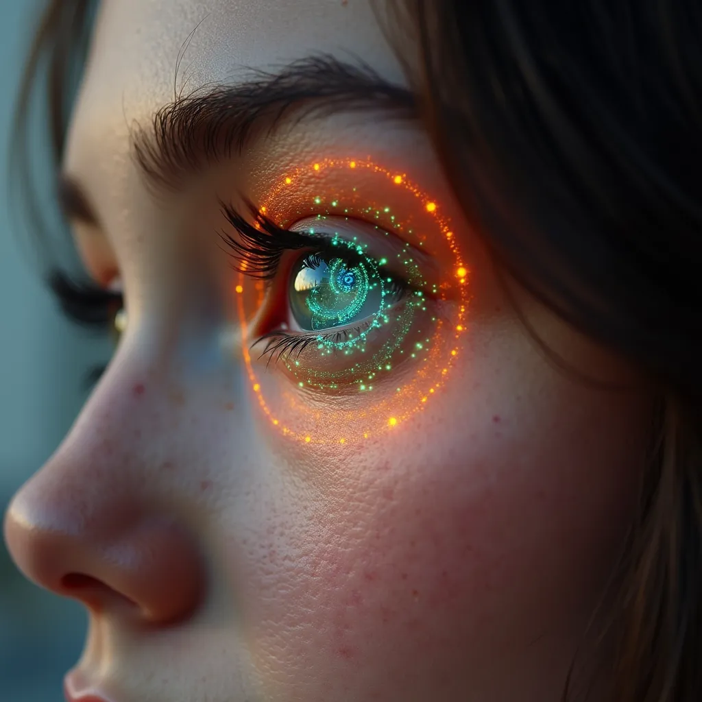

# Face Detection and Recognition System


A robust face detection, recognition, and anti-spoofing system with real-time authentication capabilities.

## Features

- Real-time face detection and recognition
- Advanced anti-spoofing measures:
  - Depth estimation using iris analysis
  - Motion parallax detection
  - Lens distortion analysis
  - Focus quality check
  - Natural movement verification
- User-friendly GUI interface with camera controls
- Fast 3-second authentication
- Multi-angle face registration for better accuracy
- Database integration for face storage
- Camera controls for exposure and gain
- Performance optimization and statistics

## Prerequisites

- Python 3.10 or higher
- SQL Server with ODBC Driver 18
- CUDA-capable GPU (recommended)
- Webcam with manual exposure control
- Required Python packages (see requirements.txt)

## Installation

1. Clone the repository:
```bash
git clone https://github.com/Basel-anaya/Veronica.git
cd Veronica
```

2. Create a virtual environment:
```bash
python -m venv venv
source venv/bin/activate  # Linux/Mac
# or
.\venv\Scripts\activate  # Windows
```

3. Install dependencies:
```bash
pip install -r requirements.txt
```

4. Download required models:
   - Create a `models` directory in the project root
   - Download the InsightFace model:
     ```bash
     mkdir -p models/buffalo_l
     wget https://github.com/deepinsight/insightface/releases/download/v0.7/buffalo_l.zip
     unzip buffalo_l.zip -d models/buffalo_l/
     ```
   - Download the face landmarks model:
     ```bash
     wget http://dlib.net/files/shape_predictor_68_face_landmarks.dat.bz2
     bzip2 -d shape_predictor_68_face_landmarks.dat.bz2
     ```

5. Configure database connection:
- Update the connection string in `main.py` and `delete_duplicates.py`
- Ensure SQL Server is accessible and ODBC Driver 18 is installed

## Usage

The system offers three main modes:

1. Face Registration Mode (`python main.py` - Option 1)
   - Register new faces from ID card images
   - Place ID card images in the `ID-samples` folder with format: `name-ID.jpg`
   - Supports multiple angle registration for better recognition

2. Face Detection Mode (`python main.py` - Option 2)
   - Real-time face detection and recognition
   - Anti-spoofing checks with confidence scores
   - Camera exposure and gain controls
   - Performance statistics display

3. Sample Face Addition (`python add_faces.py`)
   - Add sample faces to the database
   - Place face images in the `faces` directory

Additional Utilities:
- `delete_duplicates.py`: Clean up duplicate face entries in the database

## System Components

1. Face Recognition
   - InsightFace-based face embedding extraction
   - Cosine similarity matching
   - Temporal smoothing for stability

2. Anti-Spoofing
   - Iris-based depth estimation
   - Motion analysis with regional weights
   - Lens distortion patterns
   - Focus quality assessment
   - Natural micro-movement detection

3. Camera Controls
   - Manual exposure adjustment
   - Gain control
   - Buffer size optimization
   - Frame rate management

## Performance Optimization

- Adaptive frame processing
- Multi-threaded operation
- Batch processing for database operations
- Caching mechanisms for face embeddings
- Resolution scaling based on distance

## Troubleshooting

Common issues and solutions:

1. Database Connection:
   - Verify SQL Server is running
   - Check credentials in connection string
   - Ensure ODBC Driver 18 is installed

2. Camera Issues:
   - Check camera permissions
   - Adjust exposure/gain settings
   - Verify camera index
   - Ensure proper USB connection

3. Performance Issues:
   - Verify CUDA installation
   - Update GPU drivers
   - Adjust input resolution
   - Check system resources

4. Recognition Issues:
   - Ensure proper lighting
   - Maintain optimal distance (35-75cm)
   - Check face angle
   - Verify database entries

## License

[MIT](LICENSE)