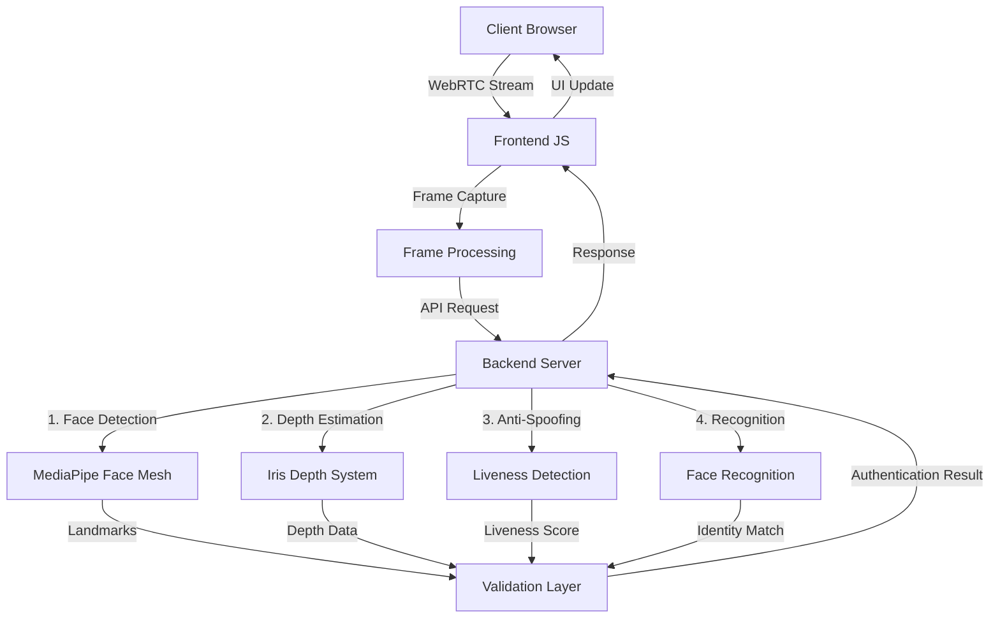
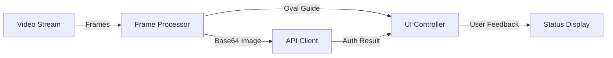
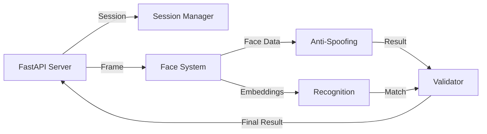
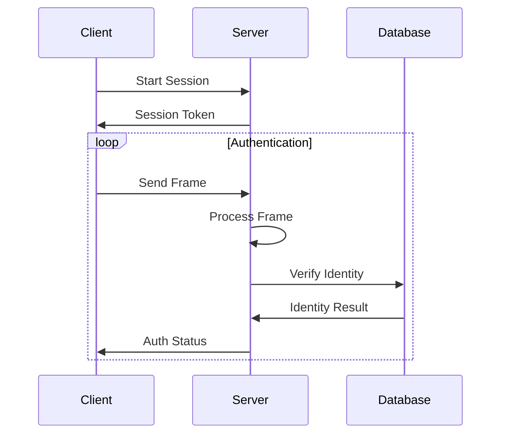
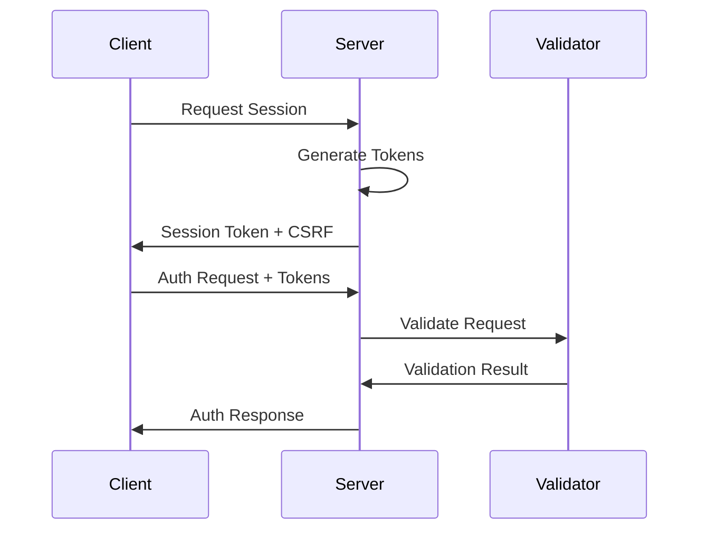
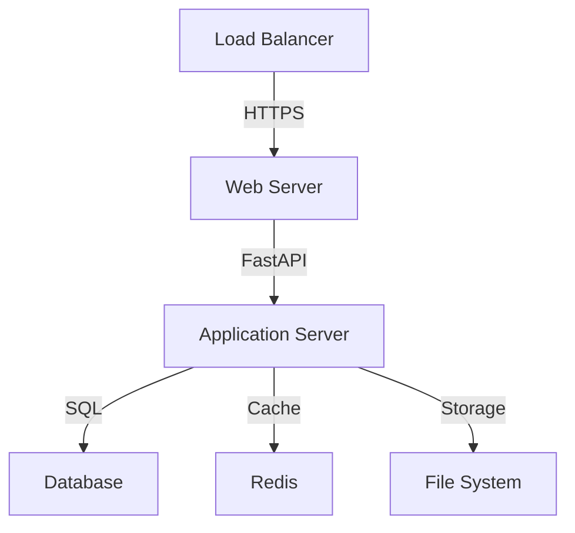

# Veronica System Architecture

## System Flow

## Component Interactions

### 1. Frontend Layer

### 2. Backend Layer

### 3. Data Flow

## System Components

### Frontend Components
- **Video Controller**: Manages WebRTC stream
- **Frame Processor**: Handles frame capture and preprocessing
- **UI Controller**: Manages user interface and feedback
- **API Client**: Handles communication with backend

### Backend Components
- **Session Manager**: Handles authentication sessions
- **Face System**: Core face processing pipeline
- **Anti-Spoofing**: Liveness detection and validation
- **Recognition System**: Face recognition and matching
- **Database Manager**: Handles face embeddings storage

### Security Components
- **Token Manager**: Handles session tokens
- **Rate Limiter**: Controls request frequency
- **Validator**: Validates requests and responses
- **Error Handler**: Manages error responses

## Performance Considerations

### Optimization Points
1. **Frame Processing**
   - Frame skipping
   - Size optimization
   - Quality control

2. **Resource Management**
   - GPU memory management
   - Connection pooling
   - Cache optimization

3. **Error Handling**
   - Graceful degradation
   - Automatic recovery
   - User feedback

## Security Architecture

### Authentication Flow

### Security Layers
1. **Transport Security**
   - HTTPS enforcement
   - Secure WebSocket
   - Certificate validation

2. **Session Security**
   - Token validation
   - CSRF protection
   - Rate limiting

3. **Data Security**
   - Input validation
   - Output sanitization
   - Error handling

## Deployment Architecture

### Production Setup

### Scaling Considerations
1. **Horizontal Scaling**
   - Multiple application instances
   - Load balancing
   - Session persistence

2. **Vertical Scaling**
   - GPU optimization
   - Memory management
   - CPU utilization

3. **Resource Distribution**
   - Cache distribution
   - Database sharding
   - Storage management 